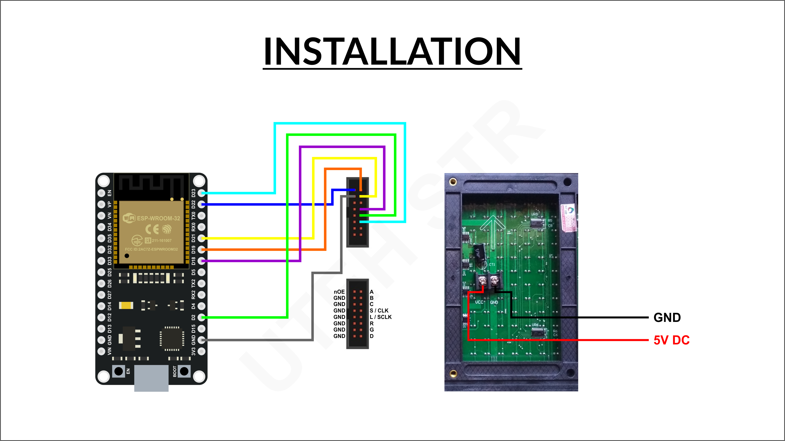

# P10-Bluetooth-Voice-LED

**This project consists of converting speech to text then displaying it on a P10 LED diplay.**  

### You'll need:

* ESP32
* Android Smartphone
* P10 LED Display
* Jumpers
* Arduino IDE
* 5V power source for LED panel

## Wiring

## Video of project

* See on YouTube [YouTube](https://www.youtube.com/shorts/CdB46p9WKJQ).

## Important notes!

* For ESP32 you'll need v2 (I used v2.0.2, some I read used v2.0.5) board library otherwise P10 output will not work with DMD32 library!
* Works without any additional signal amplification needed. (P10 display will probably need separate power suppply though.)
* If the following behavior is seen:
ESP32 restarts as soons as you try to connect to it, or keep getting into a restart loop with an assert error, then flash the SerialToBT example code on the ESP then flash this code again.
* ESP8266 is not compatible with this project as it has no Bluetooth HW.
* For Arduino similar code can be used, but DMD library has to be used instead of DMD32. There's plenty of examples of that online, so I'll not elaborate more on that.

## Sources

* WebServer Controlled P10 display with ESP [YouTube](https://www.youtube.com/watch?v=Nkhmpz1rV78).
* Reddit
* Githib

